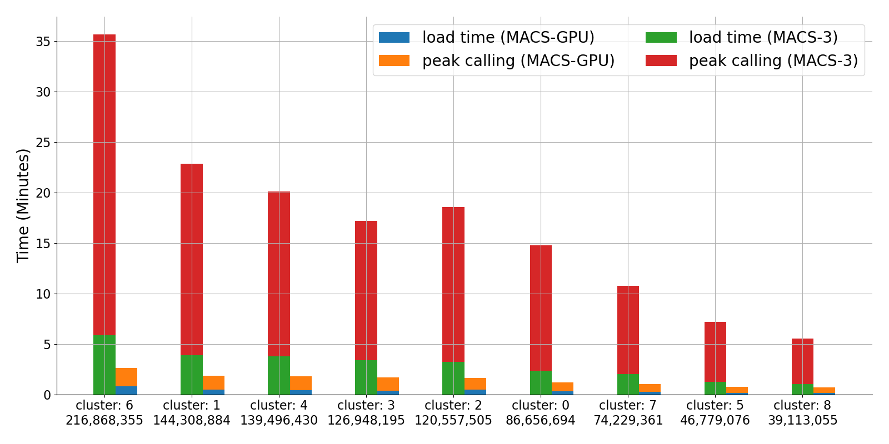
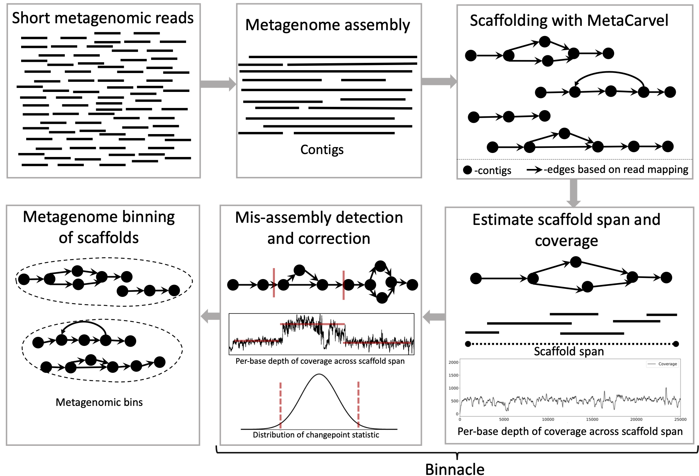
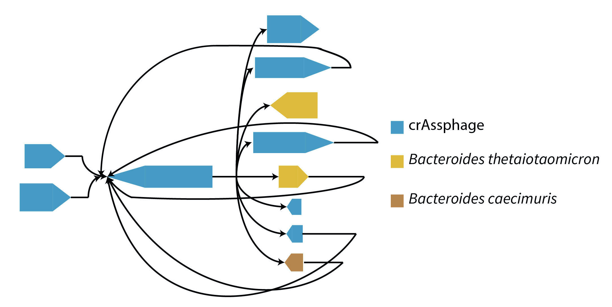
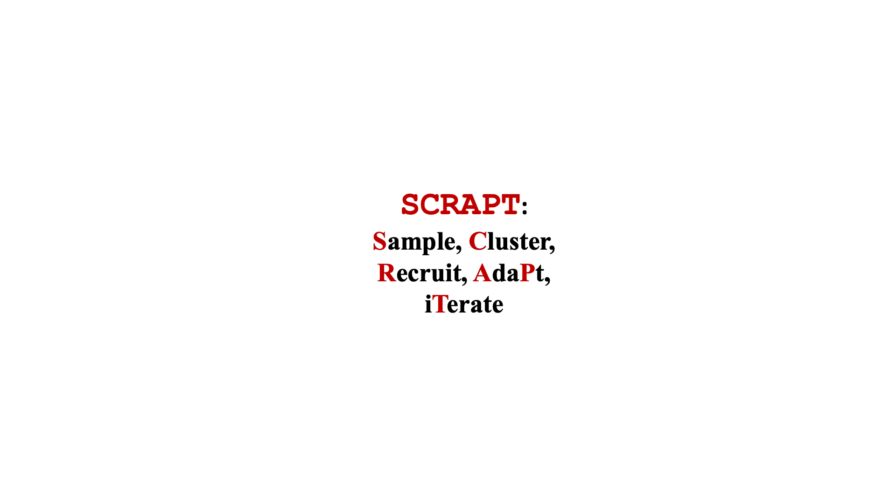
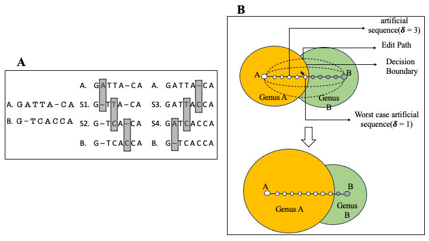

In this page I maintain a list of some projects that I have actively contributed to.
{: .post-description}

* * *

## **Verifiable agent benchmarks**

At LatchBio we build verifiable benchmarks that grade whether AI agents recover the right biological conclusions from realistic experimental data.

<ul class="benchmark-list">
<li>

<a href="https://benchmarks.bio/spatial" target="_blank">SpatialBench</a>

146 verifiable problems from practical spatial transcriptomics workflows across five technologies and seven task categories. Each task gives an agent a snapshot of real experimental data immediately before a key analysis step, then grades whether it recovers the right biological result.

</li>
<li>

<a href="https://benchmarks.bio/spatial-long" target="_blank">SpatialBench-Long</a>

24 long-horizon evaluations in which agents must derive biological claims from raw or near-raw spatial data without prescribed methods. Covers pancreatic cancer, glioblastoma organoids, lineage-traced lung adenocarcinoma, and mouse optic nerve aging systems.

</li>
<li>

<a href="https://benchmarks.bio/sc" target="_blank">scBench</a>

394 verifiable problems from practical scRNA-seq workflows across six sequencing platforms and seven task categories. Each problem tests whether an agent can extract biological insight from messy, real-world single-cell datasets with a deterministic grader.

</li>
<li>

<a href="https://benchmarks.bio/epi" target="_blank">EpiBench</a>

106 short-horizon evaluations across CUT&Tag/CUT&RUN, ATAC-seq, ChIP-seq, and DNA methylation workflows. Tests whether agents make well-defined analysis decisions from realistic workflow states and return deterministically gradable answers.

</li>
</ul>

* * *

## **`gmacs`** <a href="https://github.com/latchbio-workflows/gmacs" class="project-link" target="_blank" title="GitHub"><i class="fab fa-github"></i></a>
{: style="float: right; padding-left:10px" ;height="120%" width="56%"}
Peak calling is a core step in ATAC-seq and ChIP-seq analysis: after aligning reads, tools identify regions where chromatin accessibility or protein–DNA binding differs from a control. MACS3 is the standard peak caller, but its CPU implementation was not built for the data volumes produced by single-cell and spatial epigenomics assays, where peak calling can become a rate-limiting step that takes days on industry workloads.

**`gmacs`** is our GPU-accelerated reimplementation of MACS3, written with [CuPy](https://cupy.dev/){:target="_blank"}. Instead of storing reads in coordinate tables and computing pileups in a separate pass, `gmacs` accumulates pileups directly into GPU arrays as data loads—cutting both load time and peak-calling runtime. On a ~1B-read scATAC-seq benchmark, `gmacs` runs roughly **15× faster** than MACS3 while maintaining 98–99% peak overlap (see figure). We walk through the algorithm and benchmarks in [our blogpost](https://blog.latch.bio/p/gpu-peak-calling-for-epigenetics){:target="_blank"}; source code is on [GitHub](https://github.com/latchbio-workflows/gmacs){:target="_blank"}.

* * *

## **Binnacle** <a href="https://github.com/marbl/binnacle" class="project-link" target="_blank" title="GitHub"><i class="fab fa-github"></i></a>
{: style="float: left; padding-right:10px" ;height="150%" width="53.4%"}
High-throughput sequencing has revolutionized the field of microbiology, however, reconstructing complete genomes of organisms from whole metagenomic shotgun sequencing data remains a challenge. Recovered genomes are often highly fragmented, due to uneven abundances of organisms, repeats within and across genomes, sequencing errors, and strain-level variation. To address the fragmented nature of metagenomic assemblies, scientists rely on a process called binning, which clusters together contigs inferred to originate from the same organism. Existing binning algorithms use oligonucleotide frequencies and contig abundance (coverage) within and across samples to group together contigs from the same organism. However, these algorithms often miss short contigs and contigs from regions with unusual coverage or DNA composition characteristics, such as mobile elements. Here, we propose that information from assembly graphs can assist current strategies for metagenomic binning. We use MetaCarvel, a metagenomic scaffolding tool, to construct assembly graphs where contigs are nodes and edges are inferred based on paired-end reads. We developed [Binnacle](https://github.com/marbl/binnacle){:target="_blank"}, a tool that extracts information from the assembly graphs and clusters scaffolds into comprehensive bins. Binnacle also provides wrapper scripts to integrate with existing binning methods. We show that binning graph-based scaffolds, rather than contigs, improves the contiguity and quality of the resulting bins, and captures a broader set of the genes of the organisms being reconstructed. We use [MetaCarvel](https://github.com/marbl/MetaCarvel){:target="_blank"} a tool developed at Poplab to generate variant aware scaffolds. A poster version of binnacle appeared in ISMB 2020 and please find a short talk [here](https://www.youtube.com/watch?v=MEq3yDuYoOQ&ab_channel=ISCB){:target="_blank"}.

* * *

## **PIRATE** <a href="https://github.com/hsmurali/PIRATE" class="project-link" target="_blank" title="GitHub"><i class="fab fa-github"></i></a>
{: style="float: right; padding-left:10px" ;height="120%" width="56%"}
Bacteriophages are viruses that infect and destroy bacteria. As bacteria rapidly evolve to counter the effect of antibiotic drugs, bacteriophages are being explored as complements and alternatives to antibiotics. Identification and characterization of novel phage from sequencing data is critical to achieve this goal, but presents many computational challenges. We developed [MetaCarvel](https://github.com/marbl/MetaCarvel){:target="_blank"}, a scaffolding tool that detects assembly graph motifs representative of biologically-relevant variants. Some bubble and repeat motifs detected by MetaCarvel represent phage integration events, providing the opportunity for detecting novel phage within microbial communities. Our assembly graph based methods were able to detect crAssphage (the first computationally identified phage) within variants in 208 human gut microbiome samples. To identify novel phage in metagenomes, we extracted repeat and bubble contigs that did not share sufficient similarity with known organisms. We clustered contigs with similar genomic content and blasted predicted genes from each cluster against a custom UniProt phage database. Multiple clusters contained sequences rich in integrase genes, tail proteins and tape measure proteins, suggesting these sequences represent genomicfragments from previously uncharacterized phage. [PIRATE](https://github.com/hsmurali/PIRATE){:target="_blank"} is still under active development and appeared as a [short talk](https://www.youtube.com/watch?v=YytwmfCYLFY&ab_channel=ISCB){:target="_blank"} at ISMB 2020.

* * *

## **SCRAPT** <a href="https://github.com/hsmurali/SCRAPT" class="project-link" target="_blank" title="GitHub"><i class="fab fa-github"></i></a>
{: style="float: left; padding-right:10px" ;height="120%" width="56%"} 
**Motivation**: 16S rRNA gene sequence clustering is an important tool in characterizing the diversity of microbial communities. As 16S rRNA gene data sets are growing in size, existing sequence clustering algorithms increasingly become an analytical bottleneck. Existing methods spend a lot of time with clustering singletons and produce fragmented clusters leaving a gap for further improvements. 
**Results**: We propose an iterative sampling-based 16S rRNA gene sequence clustering approach that targets the largest clusters in the data set, allowing users to stop the clustering process when sufficient clusters are available for the specific analysis being targeted. We describe a probabilistic analysis of the iterative clustering process that supports the intuition that the clustering process identifies the larger clusters in the data set first. Using real data sets of 16S rRNA gene sequences, we show that our iterative algorithm, coupled with an adaptive sampling process and a mode-shifting strategy for identifying cluster representatives, substantially speeds up the clustering process while being effective at capturing the large clusters in the dataset. The experiments also show [`SCRAPT`](https://github.com/hsmurali/SCRAPT){:target="_blank"} is able to produce Operational Taxonomic Unit (OTUs) which are less fragmented than popular tools DNACLUST, CDHIT, UCLUST, and DADA2. 
**Software Availability**: The algorithm is implemented in the open-source package [`SCRAPT`](https://github.com/hsmurali/SCRAPT){:target="_blank"}.

* * *

## **The impact of transitive annotation on the training of taxonomic classifiers** <a href="https://github.com/hsmurali/Transitive_Annotation" class="project-link" target="_blank" title="GitHub"><i class="fab fa-github"></i></a>
{: style="float: right; padding-left:10px" ;height="105%" width="60%"}
A common task in the analysis of microbial communities involves assigning taxonomic labels to the sequences derived from organisms found in the communities. Frequently, such labels are assigned using machine learning algorithms that are trained to recognize individual taxonomic groups based on training data sets that comprise sequences with known taxonomic labels. Ideally, the training data should rely on labels that are experimentally verified-formal taxonomic labels require knowledge of physical and biochemical properties of organisms that cannot be directly inferred from sequence alone. However, the labels associated with sequences in biological databases are most commonly computational predictions which themselves may rely on computationally-generated data-a process commonly referred to as "transitive annotation". In this work, we explore the implications of training a machine learning classifier (the Ribosomal Database Project's Bayesian classifier in our case) on data that itself has been computationally generated. We demonstrate that even a few computationally-generated training data points can significantly skew the output of the classifier to the point where entire regions of the taxonomic space can be disturbed. We also discuss key factors that affect the resilience of classifiers to transitively-annotated training data, and propose best practices to avoid the artifacts described in our paper. Code and analysis scripts are on [GitHub](https://github.com/hsmurali/Transitive_Annotation){:target="_blank"}.